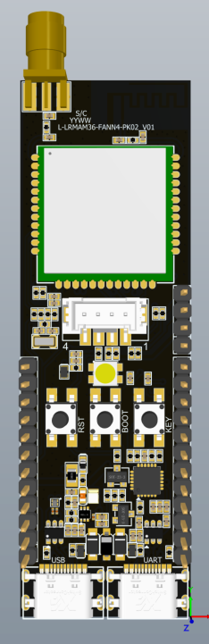
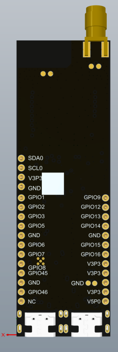
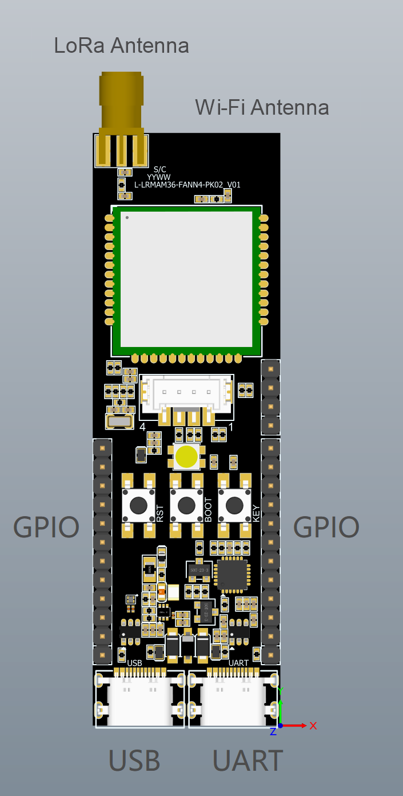

# Lierda AM36 Pico LoRa Example

Language: [中文](README.md) | English

This is an ESP-IDF based LR2021 LoRa example for the Lierda AM36 Pico development board L-LRMAM36-FANN4-PK02. It demonstrates LoRa point-to-point communication, RF parameter configuration, and interactive UART debugging.

L-LRMAM36-FANN4-PK02 is an evaluation development board based on the Lierda AM36 module L-LRMAM36-FANN4. The AM36 module is mounted before shipment. The module is designed with ESP32-S3 and LR2021, and supports Wi-Fi, BLE, Generation 4 LoRa, FLRC, and 2-FSK/4-FSK wireless capabilities. It can be used for LoRa RF performance evaluation and application development.

## Table of Contents

- [Board Overview](#board-overview)
- [Interface Overview](#interface-overview)
- [Hardware Documents](#hardware-documents)
- [Development Environment](#development-environment)
- [Quick Start](#quick-start)
- [Flashing](#flashing)
- [UART Debugging](#uart-debugging)
- [RF Parameters and CLI](#rf-parameters-and-cli)
- [Project Structure](#project-structure)
- [FAQ](#faq)
- [Safety Notes](#safety-notes)
- [Additional Resources](#additional-resources)

## Board Overview

| Front | Back |
| --- | --- |
|  |  |

| Item | Description |
| --- | --- |
| Recommended board | Lierda AM36 Pico L-LRMAM36-FANN4-PK02 |
| Mounted module | L-LRMAM36-FANN4, mounted before shipment |
| MCU and RF chip | ESP32-S3 + LR2021 |
| Wireless capabilities | Wi-Fi, BLE, Generation 4 LoRa, FLRC, and 2-FSK/4-FSK |
| Operating bands | LoRa: 863 MHz to 930 MHz; Wi-Fi/BLE: 2400 MHz to 2500 MHz |
| Module dimensions | 20 mm x 20 mm x 2.5 mm |
| Internal memory | 8 MB Flash + 8 MB PSRAM |
| USB-to-UART | On-board CP2105 dual-channel USB-to-UART bridge |

The development kit usually includes:

| No. | Item | Qty | Description |
| --- | --- | --- | --- |
| 1 | AM36 Pico development board L-LRMAM36-FANN4-PK02 | 1 pc | The AM36 module L-LRMAM36-FANN4 is mounted before shipment. |
| 2 | LoRa antenna | 1 pc | Used for LoRa RF communication and testing. |
| 3 | USB Type-C data cable | 1 pc | Used for USB flashing or UART debugging. Use a cable that supports data transfer. |

## Interface Overview



The board provides two Type-C connectors. The `USB` port is connected to the AM36 module USB interface and is used for firmware flashing and USB-JTAG/Serial debugging. The `UART` port uses the on-board CP2105 dual-channel USB-to-UART bridge to expose two UART channels for the sample CLI and user application expansion.

| Interface / Component | Description |
| --- | --- |
| LoRa antenna connector | SMA connector for the standard LoRa antenna. |
| On-board Wi-Fi antenna | On-board PCB antenna. |
| USB | Type-C connector connected to the AM36 module USB interface, used for firmware flashing and USB-JTAG/Serial debugging. |
| UART | Type-C connector with an on-board CP2105 dual-channel USB-to-UART bridge; after connection to a PC, Enhanced and Standard COM ports are enumerated. |
| GPIO | AM36 module GPIO expansion interface. Functions can be multiplexed by software. For detailed pin functions, refer to the module hardware design manual. |
| RST | Reset button, active low. |
| BOOT | Download-mode button used with RESET to enter firmware download mode. |
| KEY | User-defined button. The function is defined by the user application. |

## Hardware Documents

The `docs/` directory provides board-level and module-level reference material:

| File | Description |
| --- | --- |
| [L-LRMAM36-FANN4-PK02_SCH_V01.pdf](docs/L-LRMAM36-FANN4-PK02_SCH_V01.pdf) | Development board schematic. Use this file to understand electrical connections and signal routing on the AM36 Pico development board. |
| [L-LRMAM36-FANN4-PK02_layout_V01.pdf](docs/L-LRMAM36-FANN4-PK02_layout_V01.pdf) | Development board layout file. Use this file to review PCB placement, routing, and board-level implementation details. |
| [L-LRMAM36-FANN4_V01.step](docs/L-LRMAM36-FANN4_V01.step) | AM36 module 3D mechanical model for enclosure fitting, mechanical checking, and installation reference. |
| [Lierda L-LRMAM36-FANN4 Hardware Design Manual_EN_Rev1.0.pdf](docs/Lierda%20L-LRMAM36-FANN4%20Hardware%20Design%20Manual_EN_Rev1.0.pdf) | English module hardware design manual for module specifications, pin definitions, electrical characteristics, and integration guidance. |
| [Lierda L-LRMAM36-FANN4 Hardware Design Manual_CN_Rev1.0.pdf](docs/Lierda%20L-LRMAM36-FANN4%20Hardware%20Design%20Manual_CN_Rev1.0.pdf) | Chinese module hardware design manual for Chinese-language hardware integration reference. |

## Development Environment

- ESP-IDF v5.0 or later
- [lierda-iot/esp_lora_driver](https://components.espressif.com/components/lierda-iot/esp_lora_driver)

`esp_lora_driver` is fetched automatically by ESP-IDF Component Manager according to [main/idf_component.yml](main/idf_component.yml). During the first build, make sure the network can access the [ESP Component Registry](https://components.espressif.com/).

## Quick Start

### 1. Install ESP-IDF

- Windows: Use the [ESP-IDF Windows setup guide](https://docs.espressif.com/projects/esp-idf/en/stable/esp32s3/get-started/windows-setup.html).
- macOS / Linux: Use the [ESP-IDF Linux/macOS setup guide](https://docs.espressif.com/projects/esp-idf/en/stable/esp32s3/get-started/linux-macos-setup.html).

After installation, open an ESP-IDF command-line terminal and run:

```bash
idf.py --version
```

If v5.x.x or later is printed, the environment is ready.

### 2. Get the Code

```bash
git clone https://github.com/lierda-iot/esp32_lora_samples.git
cd esp32_lora_samples
```

### 3. Build the Project

```bash
idf.py set-target esp32s3
idf.py build
```

After a successful build, the terminal prints:

```bash
Project build complete. To flash, run:
idf.py flash
```

## Flashing

Connect the development board `USB` Type-C port to the computer. This port is connected to the AM36 module USB interface and is used for firmware flashing and USB-JTAG/Serial debugging.

Use a USB Type-C cable that supports data transfer. If a charge-only cable is used, the PC cannot recognize the device.

```bash
idf.py flash
```

If multiple USB devices are connected to the computer, specify the port manually:

```bash
# Windows
idf.py -p COM3 flash

# Linux
idf.py -p /dev/ttyACM0 flash

# macOS
idf.py -p /dev/cu.usbmodem-xxxx flash
```

If flashing fails, manually enter download mode and flash again:

1. Press and hold the `BOOT` button.
2. Press the `RESET` button once.
3. Release the `BOOT` button.
4. Run `idf.py flash` again.

## UART Debugging

The interactive CLI of this example is exposed on the development board `UART` Type-C port. This port uses the on-board CP2105 dual-channel USB-to-UART bridge to connect two ESP32-S3 UARTs from the AM36 module. The example uses the `Enhanced COM Port` mapped to UART1 by default.

| PC-side device name | UART | Module pins | Debug settings | Purpose |
| --- | --- | --- | --- | --- |
| Silicon Labs Dual CP2105 USB to UART Bridge: Enhanced COM Port | UART1 | GPIO47/GPIO48 | 921600, 8N1 | Default application communication and CLI debug UART |
| Silicon Labs Dual CP2105 USB to UART Bridge: Standard COM Port | UART0 | GPIO43/GPIO44 | Configured by user application | Second UART, configurable by user application |

Debugging steps:

1. Install the CP210x USB-to-UART driver.
2. Connect the development board `UART` Type-C port to the computer.
3. Confirm the port number of the `Enhanced COM Port` in Device Manager or the system serial port list.
4. Open the port with a serial terminal such as SSCOM, PuTTY, Tera Term, or minicom.
5. Set the serial parameters to `921600, 8N1`.
6. Reset the development board and enter `help` in the serial terminal.

## RF Parameters and CLI

### Default RF Parameters

| Parameter | Default Value |
| --- | --- |
| Frequency | 868 MHz |
| TX Power | 14 dBm |
| Modulation | LoRa |
| Spreading Factor | SF7 |
| Bandwidth | 125 kHz |
| Coding Rate | 4/5 |
| Preamble | 8 symbols |
| Sync Word | 0x12, private network |
| Header Type | Explicit |
| CRC | Enabled |

### CLI Command Reference

Connect to the UART1 Enhanced COM Port at 921600 baud. Type `help` to see all commands.

#### General Commands

| Command | Description |
| --- | --- |
| `help` | Show command list and usage |
| `clear` | Clear terminal screen |
| `list` | List commands |
| `info` | Show product and firmware information |

#### RF Commands

| Command | Usage | Description |
| --- | --- | --- |
| `show` | `show` | Show current RF configuration |
| `modem` | `modem <lora\|gfsk\|flrc>` | Get or set RF modem type |
| `freq` | `freq <frequency_in_hz>` | Get or set RF frequency |
| `power` | `power <dBm>` | Get or set RF TX power |
| `syncword` | `syncword <hex_value>` | Get or set RF sync word |
| `tx` | `tx <hex byte> [hex byte] ...` | Send RF packet |
| `rx` | `rx` | Start RF receive |
| `standby` | `standby` | Put RF in standby mode |
| `sleep` | `sleep <0\|1>` | Put RF in sleep mode. `1` keeps configuration on wakeup. |
| `wakeup` | `wakeup` | Wake up RF from sleep mode |
| `reset` | `reset` | Reset the radio |
| `per` | `per <0\|1>` | Enable or disable PER statistics |

#### LoRa Parameter Commands

| Command | Usage | Description |
| --- | --- | --- |
| `lora_sf` | `lora_sf <5~12>` | Get or set LoRa spreading factor |
| `lora_bw` | `lora_bw <31\|62\|125\|250\|500\|1000>` | Get or set LoRa bandwidth in kHz |
| `lora_cr` | `lora_cr <4/5\|4/6\|4/7\|4/8\|li4/5\|li4/6\|li4/8>` | Get or set LoRa coding rate |
| `lora_preamble` | `lora_preamble <length>` | Get or set LoRa preamble length |
| `lora_syncword` | `lora_syncword <0x12\|0x34>` | Get or set LoRa sync word |
| `lora_cad` | `lora_cad [rx_timeout_ms]` | Start LoRa CAD detection, optionally setting the RX timeout after activity is detected |

#### Test Mode Commands

| Command | Description |
| --- | --- |
| `tx_cw` | Transmit continuous wave |
| `tx_preamble` | Transmit infinite preamble |

### LoRa Point-to-Point Test Example

Prepare two AM36 Pico development boards, flash the same firmware, and connect each board's UART1 Enhanced COM Port.

Receiver:

```text
freq 868000000
rx
```

Transmitter:

```text
freq 868000000
tx 01 02 03 04
```

## Project Structure

```text
.
|-- CMakeLists.txt
|-- README.md
|-- README_EN.md
|-- dependencies.lock
|-- components/
|   `-- microrl/
|-- docs/
|   |-- pic/
|   |-- L-LRMAM36-FANN4-PK02_SCH_V01.pdf
|   |-- L-LRMAM36-FANN4-PK02_layout_V01.pdf
|   |-- L-LRMAM36-FANN4_V01.step
|   |-- Lierda L-LRMAM36-FANN4 Hardware Design Manual_CN_Rev1.0.pdf
|   `-- Lierda L-LRMAM36-FANN4 Hardware Design Manual_EN_Rev1.0.pdf
`-- main/
    |-- CMakeLists.txt
    |-- idf_component.yml
    |-- Kconfig.projbuild
    |-- main.c
    |-- LiotRfCmd.c
    |-- LiotRfCmd.h
    |-- LiotUart.c
    `-- LiotUart.h
```

## FAQ

### Component Not Found During Build

During the first build, `lierda-iot/esp_lora_driver` is downloaded automatically from the [ESP Component Registry](https://components.espressif.com/). Make sure the PC can access the registry. If you are using a proxy network, configure the proxy first.

### USB Port Is Not Recognized

- Confirm that the USB Type-C cable supports data transfer.
- Try another USB port on the PC.
- Systems earlier than Windows 10 may require an appropriate USB driver.

### Flashing Fails

- Manually enter download mode and flash again.
- Confirm that the correct flashing port is selected.
- Close any other program that is using the port.

### No UART Output

- Confirm that the CP210x driver is installed.
- Confirm that the development board `UART` Type-C port is connected, not the `USB` Type-C port.
- Confirm that the CP2105 `Enhanced COM Port` is selected.
- Confirm that the serial settings are `921600, 8N1`.
- Confirm that the firmware has been flashed correctly and that the development board has been reset and is running.

## Safety Notes

- Follow the radio regulations of the country or region where the wireless device is used.
- Do not operate wireless devices in environments where they may cause safety risks, such as aircraft, restricted hospital areas, gas stations, chemical plants, or blasting areas.
- When using LoRa RF test functions, select legal frequency bands and TX power according to local regulations.

## Additional Resources

- [ESP-IDF Programming Guide](https://docs.espressif.com/projects/esp-idf/en/stable/esp32s3/)
- [ESP Component Registry](https://components.espressif.com/)
- [esp_lora_driver](https://components.espressif.com/components/lierda-iot/esp_lora_driver)

## Legal Notice

This document and related materials are provided by Lierda Science & Technology Group Co., Ltd. Lierda reserves the right to modify and improve the products, documents, and related materials without prior notice. When using this project and development board, comply with applicable laws and regulations, product manuals, and safety requirements.
